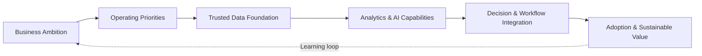

# Ashraf Selim

### Business Transformation & Data Strategy Leader | AI Readiness & Enablement

**Connecting business strategy, operating priorities, trusted data, and responsible AI to help enterprises make better decisions and build lasting transformation capability.**

Based in Cairo, Egypt · Open to senior leadership and strategic consulting conversations

---

## Executive Profile

I help organizations turn business ambition into practical transformation—aligning strategy, processes, governance, data, analytics, and AI around the decisions that matter most.

My experience spans enterprise business intelligence, executive decision support, data governance, financial and operational analytics, process improvement, and cross-system integration in the petrochemical industry. This complex industrial environment has shaped a pragmatic leadership approach: start with the business outcome, establish trusted foundations, and introduce technology where it creates clear and sustainable value.

I operate at the intersection of leadership and delivery. I can frame a transformation roadmap with executives, translate priorities into an operating model, and work with technical teams to move from fragmented information toward governed, decision-ready capabilities.

## Transformation Leadership

| Leadership domain | How I create value |
|---|---|
| **Business Transformation** | Translate strategic priorities into focused transformation portfolios, operating improvements, and actionable roadmaps. |
| **Data & Analytics Strategy** | Connect enterprise data, KPI frameworks, analytics, and executive reporting to critical business decisions. |
| **AI Strategy & Enablement** | Identify valuable AI use cases, assess organizational readiness, and define the governance and data foundations required for responsible adoption. |
| **Data Governance** | Establish ownership, quality, definitions, controls, and accountability so leaders can trust the information they use. |
| **Decision Intelligence** | Combine business context, performance management, forecasting, and analytical insight to improve the quality and speed of decisions. |
| **Change & Capability Building** | Align stakeholders, mentor teams, and embed data-driven ways of working beyond individual dashboards or projects. |

## My Transformation Architecture

This architecture keeps transformation anchored in business value. Data and AI are not isolated technology programs; they are capabilities embedded into decisions, workflows, governance, and day-to-day execution.

## Enterprise Transformation Focus

- **Strategy to execution:** convert broad ambitions into sequenced initiatives, decision rights, ownership, and practical delivery priorities.
- **From fragmented reporting to decision systems:** connect data across business functions and enterprise platforms to create a shared performance view.
- **From dashboards to management capability:** design KPI frameworks and executive insights around action, accountability, and business rhythm.
- **From data availability to data trust:** strengthen governance, quality, validation, and common definitions before scaling analytics and AI.
- **From AI interest to responsible adoption:** prioritize business-led use cases and address readiness, risk, governance, process integration, and human adoption.
- **From projects to lasting change:** build internal capability through stakeholder alignment, mentoring, documentation, and repeatable practices.

## Selected Experience

### Egyptian Propylene & Polypropylene (EPP)

**Senior Data Analyst** · Cairo, Egypt · 2017–Present 
*Business intelligence, analytics, and data-governance leadership scope*

- Lead end-to-end business intelligence and analytics initiatives that support executive, financial, commercial, and operational decision-making in the petrochemical industry.
- Develop management reporting and KPI frameworks that translate enterprise priorities into clear performance conversations.
- Integrated QuickBooks Online with Power BI to deliver consolidated financial dashboards across multiple companies.
- Develop enterprise-wide data-governance frameworks and advance quality, validation, ownership, and common-definition practices.
- Apply forecasting, statistical analysis, and predictive methods to planning and performance questions.
- Partner with business and technical stakeholders to improve processes and embed data-driven working practices.
- Mentor analysts and contribute to stronger analytical capability across the organization.

## Technology as an Enabler

I use technology to serve the transformation agenda—not to define it.

**Business intelligence & analytics**

**Enterprise data & platforms**

## Selected Credentials

<strong>View professional certifications</strong>

| Credential | Provider | Verification |
|---|---|---|
| Regression Analysis: Simplify Complex Data Relationships | Google | [Verify](https://www.coursera.org/account/accomplishments/verify/877FWHA9VHAK) |
| The Power of Statistics | Google | [Verify](https://coursera.org/share/935e0b2b10b56f77042c0e53e730d246) |
| Foundations of Data Science | Google | [Verify](https://coursera.org/share/3e2fde5f48e1acb9ab638e825b0cc39d) |
| Power BI Data Dashboards | LinkedIn Learning | [Verify](https://www.linkedin.com/learning/certificates/cf2247e666a1ba89ad3e71ae7c8218f49d43a48cfa291c293d4fccad7cb2c38c) |
| Data Preparation in Power BI | DataCamp | [Verify](https://www.datacamp.com/completed/statement-of-accomplishment/course/5338432e889847a2a541b83461cd0d5b6bcc27aa) |
| Delivering Quality Work with Agility | IBM / Coursera | [Verify](https://www.coursera.org/account/accomplishments/records/ZUE222DJYGU5) |

## Let's Build the Next Transformation

I welcome conversations with leaders who are shaping enterprise transformation, building data-driven operating models, or preparing their organizations for responsible AI adoption.

- **Leadership opportunities:** [Connect with me on LinkedIn](https://www.linkedin.com/in/ashraf-selim)
- **Strategic consulting:** [Start a strategic conversation](mailto:ashrafsleem@live.com?subject=Strategic%20Consulting%20Conversation)

**Strategy → Trusted Data → Intelligent Decisions → Sustainable Transformation**

